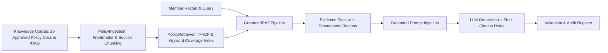

# SACCO Member-Case Preparation Agent Specification

## 1. Role & Architectural Boundaries
The SACCO Member-Case Preparation Agent assists authorized loan officers in reviewing synthetic member loan cases and querying institutional policy documents. 

**Decision Boundary Rules:**
- **Advisory Only**: The agent never makes, recommends, approves, or declines a credit decision.
- **Deterministic Arithmetic**: All financial calculations (interest, total repayment, monthly schedules) are performed exclusively by deterministic Python functions ([calculator.py](file:///c:/Users/USER/OneDrive/Desktop/SACCO%20PROJECT/SACCO-Member-Case-Preparation-Agent/evidence/demo/sacco_baseline/calculator.py)).
- **Human in the Loop**: The output is strictly a prepared case brief routed to the Credit Committee or authorized human reviewer.

---

## 2. Grounded RAG Pipeline Architecture

### Components:
1. **[ingestion.py](file:///c:/Users/USER/OneDrive/Desktop/SACCO%20PROJECT/SACCO-Member-Case-Preparation-Agent/src/rag/ingestion.py)**:
   - Reads YAML frontmatter (`source_id`, `title`, `version`, `effective_date`, `document_type`, `origin`).
   - Splits policies by Markdown section headings (`##`, `###`), creating indexed chunks.
2. **[retriever.py](file:///c:/Users/USER/OneDrive/Desktop/SACCO%20PROJECT/SACCO-Member-Case-Preparation-Agent/src/rag/retriever.py)**:
   - Indexes chunks using sublinear TF-IDF vectors with n-grams `(1, 3)`.
   - Enhances cosine similarity with query keyword coverage weighting to eliminate false positives from single common terms.
   - Formats citations adhering to the Master Source Provenance Register ([source_register.md](file:///c:/Users/USER/OneDrive/Desktop/SACCO%20PROJECT/SACCO-Member-Case-Preparation-Agent/RAG/source_register.md)).
3. **[pipeline.py](file:///c:/Users/USER/OneDrive/Desktop/SACCO%20PROJECT/SACCO-Member-Case-Preparation-Agent/src/rag/pipeline.py)**:
   - Orchestrates multi-query retrieval across 5 appraisal dimensions:
     1. General borrower eligibility & membership tenure
     2. KYC Level 2 verification & documentation
     3. Debt Service Ratio (DSR) & affordability thresholds
     4. Savings exposure multipliers & guarantor requirements
     5. Delinquency, arrears, & loan restructuring guidelines
   - Formulates grounded prompts requiring explicit `[Source ID: <id> | <title> | Section: <sec>]` citations.
   - Handles unanswerable / out-of-scope queries by emitting explicit `INSUFFICIENT EVIDENCE` safe responses.
